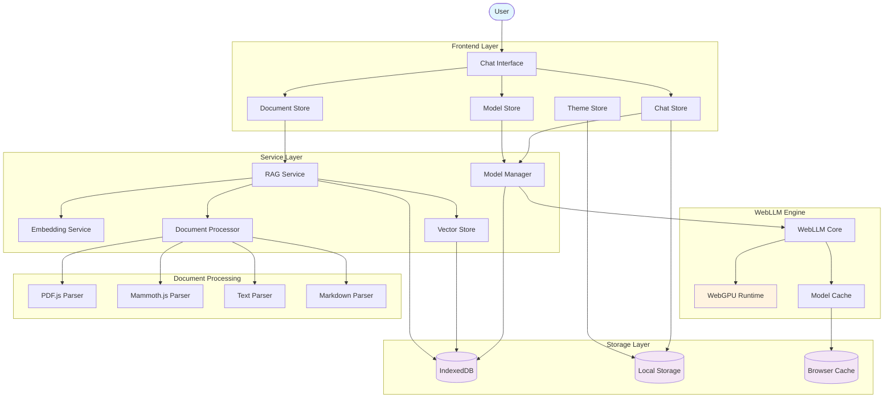

# WebLLM Chat

🌐 **[Live Demo: https://randomtask2000.github.io/WebLLMChat/](https://randomtask2000.github.io/WebLLMChat/)**

A modern chat application built with SvelteKit and WebLLM that runs entirely in the browser without requiring a backend server. Features include RAG (Retrieval-Augmented Generation) capabilities, multiple theme support, and persistent chat history.

## Features

- 🤖 **WebLLM Integration**: Run large language models directly in the browser
- 📄 **RAG Support**: Upload and search through documents (DOCX, PDF, TXT, MD, CSV)
- 🎨 **Multiple Themes**: Switch between Skeleton, Wintry, Modern, and Crimson themes
- 💬 **Chat History**: Persistent chat sessions stored in browser localStorage
- 🔄 **Model Management**: Download and switch between different LLM models
- ⚡ **Responsive Design**: Works on desktop and mobile devices
- 🧪 **Fully Tested**: Comprehensive unit and integration tests
- 📱 **PWA Ready**: Can be installed as a Progressive Web App

## Available Models

- **Llama-3.2-3B-Instruct (Context7)**: Default model with extended 128k context (2GB VRAM)
- **TinyLlama-1.1B**: Fastest loading, minimal VRAM (512MB, 2k context)
- **Llama-3.2-1B-Instruct**: Small model with 128k context (1GB VRAM)
- **Llama-3.2-3B-Instruct**: Standard 128k context version (2GB VRAM)
- **Llama-3.1-8B-Instruct**: Highest quality responses (5GB VRAM, 128k context)
- **Qwen2.5-7B-Instruct**: Excellent coding capabilities (4GB VRAM, 128k context)
- **Phi-3.5-mini-instruct**: Microsoft's efficient model (2GB VRAM, 128k context)

## Technology Stack

- **Framework**: SvelteKit with TypeScript
- **Styling**: TailwindCSS with Skeleton UI components
- **LLM Engine**: WebLLM (runs models in browser via WebGPU)
- **Document Processing**: PDF.js for PDF parsing
- **Testing**: Vitest for unit tests, Playwright for integration tests
- **Build**: Vite for fast development and optimized production builds

## NPM Packages

### Core Dependencies
- **[@mlc-ai/web-llm](https://www.npmjs.com/package/@mlc-ai/web-llm)** `^0.2.75` - WebLLM library for running LLMs in browser
- **[highlight.js](https://www.npmjs.com/package/highlight.js)** `^11.11.1` - Syntax highlighting for code blocks
- **[mammoth](https://www.npmjs.com/package/mammoth)** `^1.9.1` - DOCX to HTML conversion
- **[pdfjs-dist](https://www.npmjs.com/package/pdfjs-dist)** `^3.11.174` - PDF text extraction and rendering
- **[@floating-ui/dom](https://www.npmjs.com/package/@floating-ui/dom)** `^1.7.2` - Floating UI positioning engine

### Mobile Support
- **[@capacitor/core](https://www.npmjs.com/package/@capacitor/core)** `^7.4.2` - Cross-platform native runtime
- **[@capacitor/cli](https://www.npmjs.com/package/@capacitor/cli)** `^7.4.2` - Capacitor command-line interface
- **[@capacitor/ios](https://www.npmjs.com/package/@capacitor/ios)** `^7.4.2` - iOS platform support

### Framework & Build Tools
- **[svelte](https://www.npmjs.com/package/svelte)** `^5.1.9` - Reactive UI framework
- **[@sveltejs/kit](https://www.npmjs.com/package/@sveltejs/kit)** `^2.8.0` - Full-stack framework
- **[@sveltejs/adapter-static](https://www.npmjs.com/package/@sveltejs/adapter-static)** `^3.0.5` - Static site adapter
- **[@sveltejs/vite-plugin-svelte](https://www.npmjs.com/package/@sveltejs/vite-plugin-svelte)** `^4.0.0` - Vite plugin for Svelte
- **[vite](https://www.npmjs.com/package/vite)** `^5.4.8` - Fast build tool and dev server

### UI & Styling
- **[@skeletonlabs/skeleton](https://www.npmjs.com/package/@skeletonlabs/skeleton)** `^2.10.2` - Svelte UI toolkit
- **[@skeletonlabs/tw-plugin](https://www.npmjs.com/package/@skeletonlabs/tw-plugin)** `^0.4.0` - Tailwind plugin for Skeleton
- **[tailwindcss](https://www.npmjs.com/package/tailwindcss)** `^3.4.14` - Utility-first CSS framework
- **[@tailwindcss/forms](https://www.npmjs.com/package/@tailwindcss/forms)** `^0.5.9` - Form styling plugin
- **[@tailwindcss/typography](https://www.npmjs.com/package/@tailwindcss/typography)** `^0.5.15` - Typography plugin
- **[prismjs](https://www.npmjs.com/package/prismjs)** `^1.29.0` - Syntax highlighting library
- **[prism-themes](https://www.npmjs.com/package/prism-themes)** `^1.9.0` - Additional Prism themes
- **[postcss](https://www.npmjs.com/package/postcss)** `^8.4.47` - CSS post-processor
- **[autoprefixer](https://www.npmjs.com/package/autoprefixer)** `^10.4.20` - CSS vendor prefixing

### Testing
- **[vitest](https://www.npmjs.com/package/vitest)** `^2.1.3` - Unit testing framework
- **[@vitest/ui](https://www.npmjs.com/package/@vitest/ui)** `^2.1.3` - Vitest UI interface
- **[@playwright/test](https://www.npmjs.com/package/@playwright/test)** `^1.48.0` - End-to-end testing
- **[jsdom](https://www.npmjs.com/package/jsdom)** `^25.0.1` - DOM implementation for testing

### Development Tools
- **[typescript](https://www.npmjs.com/package/typescript)** `^5.6.3` - TypeScript compiler
- **[svelte-check](https://www.npmjs.com/package/svelte-check)** `^4.0.4` - Svelte type checker
- **[eslint](https://www.npmjs.com/package/eslint)** `^9.14.0` - JavaScript linter
- **[@typescript-eslint/eslint-plugin](https://www.npmjs.com/package/@typescript-eslint/eslint-plugin)** `^8.13.0` - TypeScript ESLint plugin
- **[@typescript-eslint/parser](https://www.npmjs.com/package/@typescript-eslint/parser)** `^8.13.0` - TypeScript ESLint parser
- **[eslint-plugin-svelte](https://www.npmjs.com/package/eslint-plugin-svelte)** `^2.44.1` - Svelte ESLint plugin
- **[eslint-config-prettier](https://www.npmjs.com/package/eslint-config-prettier)** `^9.1.0` - Prettier ESLint config
- **[prettier](https://www.npmjs.com/package/prettier)** `^3.3.3` - Code formatter
- **[prettier-plugin-svelte](https://www.npmjs.com/package/prettier-plugin-svelte)** `^3.2.7` - Svelte Prettier plugin

### TypeScript Support
- **[tslib](https://www.npmjs.com/package/tslib)** `^2.8.1` - TypeScript runtime helpers
- **[@types/node](https://www.npmjs.com/package/@types/node)** `^22.9.0` - Node.js type definitions
- **[@types/prismjs](https://www.npmjs.com/package/@types/prismjs)** `^1.26.4` - Prism.js type definitions
- **[@types/highlight.js](https://www.npmjs.com/package/@types/highlight.js)** `^9.12.4` - Highlight.js type definitions

## Development

### Prerequisites

- Node.js 18+
- Modern browser with WebGPU support (Chrome 113+, Edge 113+)

### Setup

```bash
#Install dependencies
npm install

#Start development server
npm run dev

#Run tests
npm run test

#Run integration tests
npm run test:integration

#Type checking
npm run check

#Build for production
npm run build

#Preview production build
npm run preview
```

### Project Structure
```
src/
├── lib/
│   ├── components/          # Svelte components
│   │   ├── ChatInterface.svelte
│   │   ├── ChatMessage.svelte
│   │   ├── DocumentManager.svelte
│   │   ├── DragDropZone.svelte
│   │   ├── FeatureToggle.svelte
│   │   ├── FileUpload.svelte
│   │   ├── MobileLayout.svelte
│   │   ├── ModelDropdown.svelte
│   │   ├── ModelManager.svelte
│   │   ├── RAGContext.svelte
│   │   ├── Sidebar.svelte
│   │   ├── ThemeSwitcher.svelte
│   │   └── WelcomeGuide.svelte
│   ├── config/              # Configuration files
│   │   └── features.ts
│   ├── services/            # Service layer
│   │   ├── embedding-service.ts
│   │   ├── rag-service.ts
│   │   └── vector-store.ts
│   ├── stores/              # Svelte stores for state management
│   │   ├── chat.ts
│   │   ├── documents.ts
│   │   ├── models.ts
│   │   └── theme.ts
│   ├── types/               # TypeScript type definitions
│   │   ├── index.ts
│   │   └── rag.ts
│   └── utils/               # Utility functions
│       ├── document-processor.ts
│       ├── mobile.ts
│       ├── model-loading.ts
│       ├── timeFormat.ts
│       ├── tokenCount.ts
│       └── webllm.ts
├── routes/                  # SvelteKit routes
│   ├── +layout.svelte
│   ├── +layout.ts
│   └── +page.svelte
├── app.css                  # Global styles
└── app.html                 # Main HTML template

tests/
├── unit/                    # Unit tests
│   ├── document-processor-advanced.test.ts
│   ├── document-processor.test.ts
│   └── stores.test.ts
└── integration/             # Playwright integration tests
    └── chat-flow.test.ts

static/                      # Static assets
├── _headers
├── favicon.ico
└── manifest.json
```

## Usage

1. **First Launch**: The app automatically loads a small 1B parameter model for immediate use
2. **Model Management**: Click "Models" to download larger, more capable models
3. **Chat**: Type messages in the input field and press Enter to send
4. **Document Upload**: Click "Documents" to upload files for RAG functionality
5. **Theme Switching**: Use the theme picker to change the visual style
6. **Chat History**: Previous conversations are automatically saved and can be restored

## RAG (Retrieval-Augmented Generation)

The app includes a powerful client-side RAG system that enhances AI responses with your uploaded documents. 

### Supported Document Formats
- 📕 **PDF files** - Full text extraction with metadata (title, author, page count)
- 📘 **Word documents (.docx)** - Preserves document structure (headings, lists, paragraphs)
- 📝 **Text files (.txt)** - Plain text processing
- 📋 **Markdown files (.md)** - Markdown content processing

### How to Use RAG

1. **Upload Documents**:
   - Click the **+ button** in the chat input area, or
   - **Drag and drop** files directly into the chat area
   - Use the **📁 Documents** button in the top bar

2. **Ask Questions**: The AI will automatically search your documents and use relevant content to answer

3. **View RAG Context**: Click the **RAG Context** button (right sidebar) to see:
   - Uploaded documents with chunk counts
   - Search results from your last query
   - RAG settings and configuration

### RAG Settings

Access settings in the RAG Context panel:

- **Chunk Size** (50-1000 tokens): Smaller chunks find specific facts better
- **Overlap Size** (0-200 tokens): Overlap between chunks for better context
- **Search Accuracy** (0-100%): 
  - Low (0-30%): Fuzzy matching, more results
  - Medium (40-60%): Balanced approach
  - High (70-100%): Exact matching only

### Advanced RAG Commands

Use the `/find` command to search for exact sentences:

```
/find tree
/find [term]
/find any term
```

Or use natural language:
- "Find sentences containing [term]"
- "Show me the exact sentence with [term]"
- "Quote the sentence about Jacob"
- "Find where it says about Lehi"

### Visual Indicators

- **Token Badge**: Shows when RAG context is used in responses
- **Source Citations**: Responses end with "📚 Source: [filename]"
- **Search Status**: "🔍 Searching through X documents..." appears during search
- **Processing Status**: Shows file type icons (📕 PDF, 📘 DOCX, 📄 Text) during upload

### Advanced Features

- **Smart Chunking**: Documents are intelligently split preserving structure (headings, paragraphs)
- **Metadata Extraction**: PDFs extract title, author, page count automatically
- **Structure Preservation**: DOCX files maintain heading hierarchy and lists
- **Page Tracking**: PDF chunks remember their source page numbers

For more detailed RAG usage instructions, see [RAG_USAGE_GUIDE.md](RAG_USAGE_GUIDE.md)

## Browser Compatibility

Requires a modern browser with WebGPU support:

- Chrome/Chromium 113+
- Edge 113+
- Safari 16.4+ (experimental)
- Firefox (behind flags)

## Technical Stack

### Core Framework
- **[SvelteKit](https://kit.svelte.dev/)** - Full-stack framework for building web applications
- **[Svelte 5](https://svelte.dev/)** - Reactive UI framework with compile-time optimizations
- **[TypeScript](https://www.typescriptlang.org/)** - Type-safe JavaScript for better developer experience

### AI & Machine Learning
- **[WebLLM](https://webllm.mlc.ai/)** - In-browser LLM inference engine powered by WebGPU
- **WebGPU** - Next-generation web graphics API for GPU acceleration

### UI & Styling
- **[Skeleton UI](https://www.skeleton.dev/)** - Adaptive UI toolkit for Svelte
- **[Tailwind CSS](https://tailwindcss.com/)** - Utility-first CSS framework
- **[Highlight.js](https://highlightjs.org/)** - Syntax highlighting for code blocks

### Document Processing
- **[PDF.js](https://mozilla.github.io/pdf.js/)** - PDF rendering and text extraction
- **[Mammoth.js](https://github.com/mwilliamson/mammoth.js/)** - DOCX to HTML conversion

### RAG System
- **Custom TF-IDF Implementation** - Lightweight text embeddings
- **IndexedDB** - Browser-based vector storage
- **Web Workers** - Background processing for embeddings

### Build Tools
- **[Vite](https://vitejs.dev/)** - Fast build tool and dev server
- **[PostCSS](https://postcss.org/)** - CSS processing
- **[ESLint](https://eslint.org/)** & **[Prettier](https://prettier.io/)** - Code quality tools

### Testing
- **[Vitest](https://vitest.dev/)** - Unit testing framework
- **[Playwright](https://playwright.dev/)** - End-to-end testing

### Mobile Support
- **[Capacitor](https://capacitorjs.com/)** - Native mobile app deployment

## Architecture Overview

The application follows a client-side architecture where all processing happens in the browser:

1. **LLM Inference**: WebLLM loads and runs language models directly in the browser using WebGPU
2. **Document Processing**: Files are processed client-side for privacy
3. **RAG Pipeline**: Documents → Chunking → Embeddings → Vector Store → Semantic Search
4. **State Management**: Svelte stores for reactive state management
5. **Persistent Storage**: IndexedDB for documents, embeddings, and chat history

### System Architecture Diagram



## Performance Notes

- First model load may take 1-5 minutes depending on internet speed
- Models are cached locally after first download
- Larger models provide better quality but require more VRAM
- The app continues working offline after initial model download

## License

MIT License - feel free to use this project as a starting point for your own applications.
